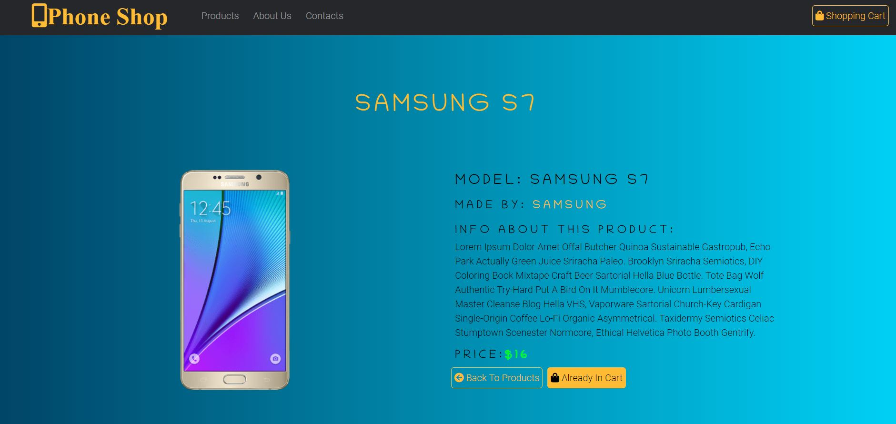

<h1>Phone Shop webpage created with react.</h1>

Fully functional online shop with easy add to cart function. When the product is in the cart, the button automatically gets disabled and showing a message in the cart. Inside the shopping cart, you can change the number of products or remove them from the cart. There are implemented PayPal button fully functioned. The web page is built using React as a base and Bootstrap for the styles of the page. Use font awesome icons for icon elements. React router to switch between pages. 

<h5>Check link hosted with netlify:  <a href="https://phone-shop-react-gurunet.netlify.app/" target="_blank">https://phone-shop-react-gurunet.netlify.app/</a>  </h5>
 

